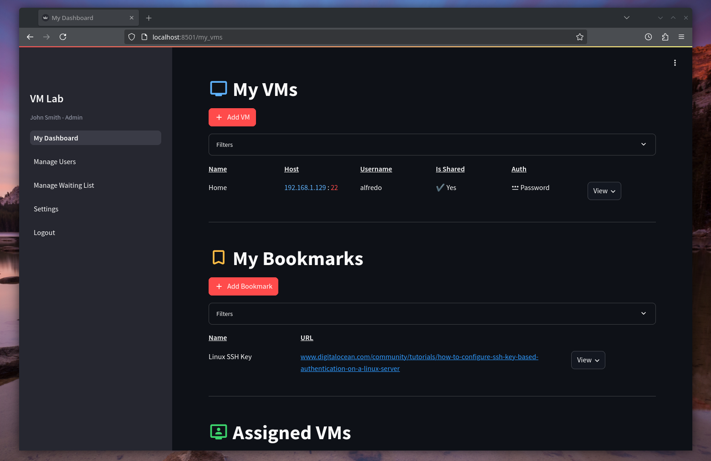
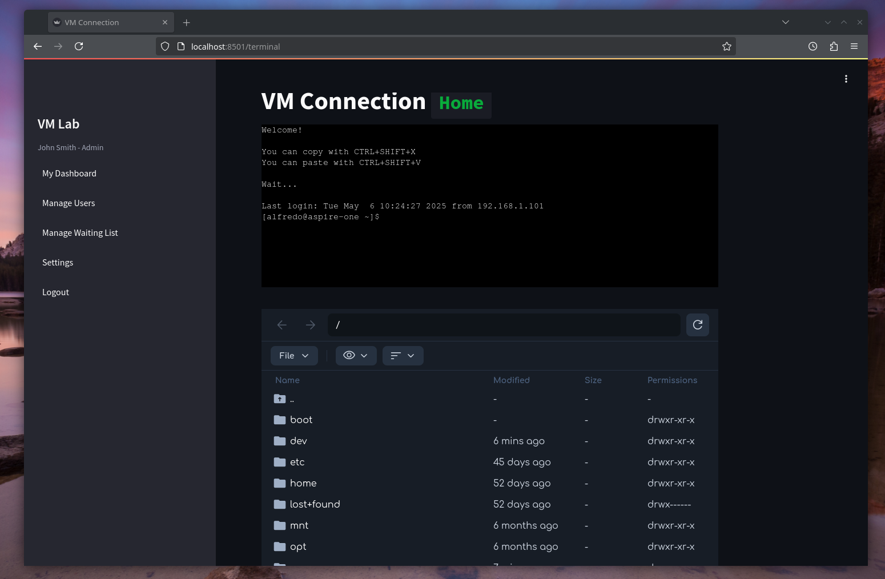

# VM Lab

## Welcome

**VM Lab** is a web-based platform for managing virtual machines (VMs), users, and bookmarks, designed for educational, research and work environments. It provides a user-friendly interface for both end-users and administrators, with robust authentication, role-based access control, and seamless integration with SSH/SFTP modules.

## Features

- **User Management**: Registration, approval workflow, role assignment, and credential editing.
- **Role-Based Access Control**: Fine-grained permissions for Admins, Managers, Sidekicks, Regular Users, and New Users.
- **VM Management**: Create, assign, edit, connect, and delete VMs with secure password/SSH key handling.
- **Bookmarks**: Save and manage useful links.
- **Interactive UI**: Built with Streamlit, featuring custom components like interactive data tables and dialogs.
- **Secure Authentication**: Uses [Streamlit-Authenticator](https://github.com/mkhorasani/Streamlit-Authenticator) with encrypted credentials and session management.
- **Database Integration**: PostgreSQL backend with SQLAlchemy ORM.
- **Modular Architecture**: Clean separation of backend, frontend, utilities, and configuration.
- **Deployment Flexibility**: Supports both Docker-based and local development setups.

## Other modules
This project is part of a modular architecture. Find out more about it [here](https://github.com/isislab-unisa/vm-lab/wiki/The-External-Modules).

- [SSH Module](https://github.com/isislab-unisa/alfresco-ssh)
- [SFTP Module](https://github.com/isislab-unisa/alfresco-sftp)

## Documentation

Full documentation and guides are available in the [Wiki](https://github.com/isislab-unisa/vm-lab/wiki).

## Contributing

- See [Contributing-To-The-Wiki](https://github.com/isislab-unisa/vm-lab/wiki/Contributing-To-The-Wiki) for documentation standards and contribution guidelines.
- Issues and feature requests are welcome!

## License

[MIT License](LICENSE)
